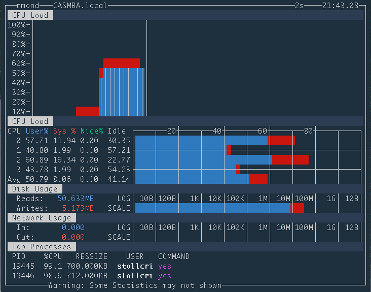

# Ncurses based System Performance Monitor for Darwin (Mac OS X)

This is a near complete rewrite of [nmon](http://nmon.sourceforge.net/) (file lmon15g.c dated 2015-07-13). The original nmon would not run under OS X since Darwin (the version of BSD which underlies Mac OS X) does not provide a /proc directory; system calls needed to replace the reading of files in the /proc directory. Upon attempting to switch /proc file reads with system calls it quickly became apparent why no one else had performed the conversion; nmond is an older program, built using older development techniques, which had grow organically over the years. Simply swapping out the relevant code would have resulted in a buggy mess, so the entire program was restructured.

Since there is already a working version for Linux (and some UNIX distributions), this project does not seek to preserve compatibility with them. All of the special code required to work with those distros was be removed to make porting easier. The program was designed and tested for OS X, but the code should compile on any other BSD variant as well.

## Building

Just type `make` in the nmond directory to build nmond. It can be installed by issuing the `sudo make install` command.

## Issues

I do not spent much time updating this program anymore. Amazingly, it has continued to work even as Apple has updated some of the deep dark places in Darwin. If an issue does come up though, let me know and I will see what I can do. Just be sure to at me in the issue. I don't check the issues here much, so otherwise it could be a while before I notice that there is a new issue.

## A Note on Security
In order to get complete process information, without requiring the use of sudo, this program is owned by root and has its setuid bit set. This is also beta software. As a general rule, it is not wise to allow beta software to have elevated permissions on your system. However, the program does not actively involve itself with remote connections, so this should only be a concern if untrusted users are given command access to the computer on which nmond is installed. The program will operate without the setuid bit (`sudo chmod u-s /usr/local/bin/nmond`), but the information it displays will be inaccurate due to lack of access; that can be mitigated by invoking it with the sudo command.

Please consider your environment before installing this application, and be sure to read and understand the license agreement.

### Potential Related Problems
Some systems have restrictions on the use of setuid programs. If the program does not give complete process information when run from a home directory, then the home directories disk may be mounted with the nosuid option. Mounting the home disk with nosuid is a sensible choice, the application should be installed to the /usr/local/bin directory.
